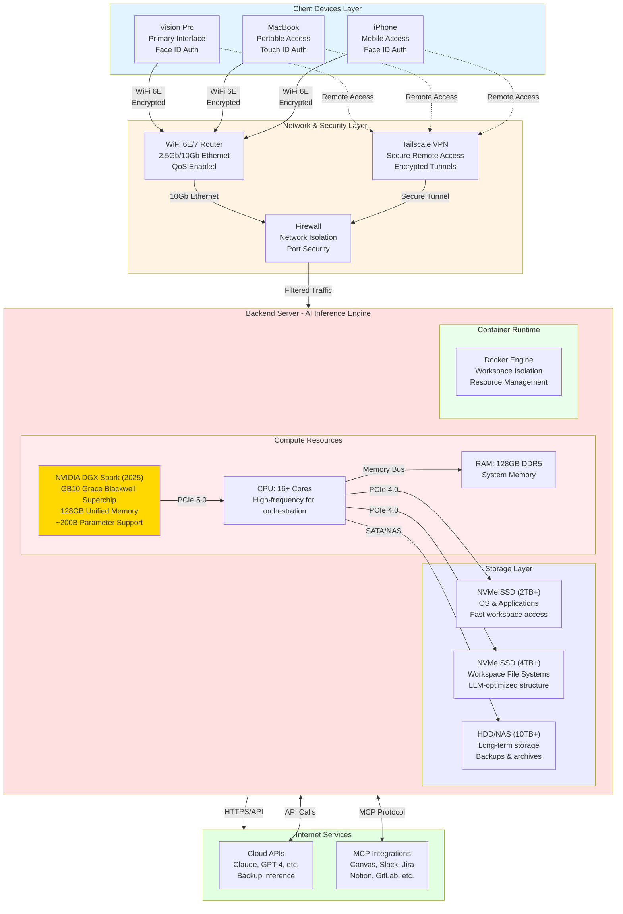

# Hardware Architecture - Master AI Workspace System

## Physical Infrastructure & Network Topology



## Hardware Specifications

### Client Devices
| Device | Role | Authentication | Connectivity |
|--------|------|----------------|--------------|
| **Vision Pro** | Primary AR/VR interface | Face ID biometric | WiFi 6E |
| **MacBook** | Portable development | Touch ID biometric | WiFi 6E / Ethernet |
| **iPhone** | Mobile quick access | Face ID biometric | WiFi 6E / 5G |

### Network Infrastructure
| Component | Specification | Purpose |
|-----------|--------------|---------|
| **Router** | WiFi 6E/7, 2.5-10Gb Ethernet | High-speed connectivity with QoS |
| **VPN** | Tailscale mesh network | Secure remote access anywhere |
| **Firewall** | Hardware or pfSense | Network isolation & security |
| **Budget** | $300-600 | Quality prosumer networking gear |

### Backend Server (AI Inference Engine)

#### GPU - Primary Inference Hardware
**NVIDIA DGX Spark (2025 Release)**
- **Chip:** GB10 Grace Blackwell Superchip
- **Memory:** 128GB unified memory
- **Capability:** Run models up to 200B parameters
- **Cost:** ~$4,000
- **Why:** Perfect balance of cost/performance for local inference
- **Alternatives:**
  - RTX 4090 (~$1,600, 24GB VRAM)
  - A6000 (~$4,000, 48GB VRAM)

#### CPU
- **Cores:** 16+ cores (e.g., AMD Ryzen 9 7950X or Intel i9-13900K)
- **Purpose:** Orchestration, routing, container management
- **Clock Speed:** High single-thread for responsive interactions

#### RAM
- **Capacity:** 128GB DDR5 (64GB minimum)
- **Speed:** 5200MT/s or faster
- **Purpose:** System memory, multiple workspace containers, caching

#### Storage Strategy
| Drive Type | Capacity | Purpose | Speed |
|------------|----------|---------|-------|
| **NVMe SSD #1** | 2TB | OS, applications, Docker images | 7000+ MB/s |
| **NVMe SSD #2** | 4TB | Workspace file systems, active projects | 7000+ MB/s |
| **HDD/NAS** | 10TB+ | Long-term storage, backups, archives | 200+ MB/s |

### Power & Cooling
- **PSU:** 1200W+ 80+ Platinum (GPU demands)
- **Cooling:** AIO liquid cooling for CPU, adequate case airflow for GPU
- **UPS:** 1500VA+ for power protection

## Network Topology

### Local Network Architecture
```
Internet
   ↓
ISP Modem (bridge mode)
   ↓
Router (WiFi 6E + 10Gb Ethernet)
   ├─→ Vision Pro (WiFi)
   ├─→ MacBook (WiFi/Ethernet)
   ├─→ iPhone (WiFi)
   └─→ Backend Server (10Gb Ethernet) ← Priority QoS
```

### Remote Access Security Layers
```
User Device (anywhere)
   ↓
Tailscale VPN (encrypted tunnel)
   ↓
Home Network Firewall
   ↓
Backend Server
   ↓
Biometric Re-auth (Face ID/Touch ID)
   ↓
Workspace Access Granted
```

## Security Architecture

### Layer 1: Network Security
- **VPN Encryption:** WireGuard protocol (Tailscale)
- **Firewall Rules:** Only Tailscale and essential ports open
- **No Port Forwarding:** Zero exposed services to public internet

### Layer 2: Device Authentication
- **Biometric:** Face ID (Vision Pro, iPhone) / Touch ID (MacBook)
- **Multi-factor:** Biometric + device possession
- **Timeout:** Auto-lock after inactivity

### Layer 3: Workspace Isolation
- **Container-level:** Each workspace in separate Docker container
- **Network Isolation:** Workspace containers on separate virtual networks
- **Credential Isolation:** Environment variables, secrets per workspace

### Layer 4: Data Encryption
- **Storage:** Encrypted NVMe drives (LUKS/FileVault)
- **Transit:** TLS 1.3 for all API communications
- **Backups:** Encrypted at rest

## Performance Targets

### Latency Goals
| Operation | Target Latency | Notes |
|-----------|---------------|-------|
| **User input → Master response** | <500ms | Orchestration layer |
| **Local LLM inference** | 20-50 tokens/sec | With DGX Spark |
| **MCP tool call** | 500ms - 2s | Depends on external API |
| **Workspace switch** | <200ms | Container already running |
| **Cold workspace start** | 2-5s | Container spin-up |

### Bandwidth Requirements
- **Local Network:** 10Gb Ethernet ideal, 2.5Gb minimum
- **Internet:** 500Mbps+ symmetric (for cloud API fallback)
- **Storage I/O:** 7000+ MB/s for responsive file operations

## Scalability Considerations

### Current Design (Single Server)
- **Users:** 1 (personal use)
- **Concurrent Workspaces:** 4 active
- **Max Sub-agents:** 10-20 simultaneously
- **Model Size:** Up to 200B parameters

### Future Scaling Options
- **Multi-GPU:** Add additional GPUs for parallel inference
- **Distributed:** LangGraph supports distributed agent networks
- **Cloud Hybrid:** Offload heavy workloads to cloud during peak
- **Kubernetes:** Graduate from Docker to K8s for multi-node

## Cost Breakdown

| Component | Cost Range | Notes |
|-----------|-----------|-------|
| **NVIDIA DGX Spark** | $4,000 | 2025 release |
| **CPU (Ryzen 9 / i9)** | $500-700 | High-end consumer |
| **RAM (128GB DDR5)** | $400-500 | 4x32GB kit |
| **NVMe SSDs (6TB total)** | $600-800 | Gen 4 drives |
| **Motherboard** | $300-400 | Adequate PCIe lanes |
| **Case + Cooling** | $300-400 | Airflow + AIO |
| **PSU (1200W+)** | $200-300 | 80+ Platinum |
| **Networking** | $300-600 | Router + switch |
| **UPS** | $200-300 | Battery backup |
| **TOTAL** | **~$7,200-8,400** | Complete build |

### Phased Purchase Strategy
1. **Phase 0 (Prototype):** Use existing hardware, cloud APIs
2. **Phase 1 (MVP):** CPU, RAM, storage ($1,500)
3. **Phase 2 (Local Inference):** Add GPU when DGX Spark ships ($4,000)
4. **Phase 3 (Production):** Network upgrades, UPS, redundancy ($1,000)

## Maintenance & Operations

### Monitoring
- **GPU Utilization:** NVIDIA SMI, Grafana dashboards
- **Container Health:** Docker stats, health checks
- **Network Performance:** Router metrics, bandwidth monitoring
- **Storage:** SMART monitoring, capacity alerts

### Backup Strategy
- **Configuration:** Git repo (nightly commit)
- **Workspace Data:** Incremental backups to NAS (daily)
- **Full System:** Weekly image to external drive
- **Off-site:** Cloud backup of critical data (monthly)

### Power Management
- **Idle Mode:** GPU power-down when unused
- **Sleep Workspaces:** Stop containers after 30min inactivity
- **Wake-on-LAN:** Remote wake server if needed
- **Estimated Power:** 300W idle, 800W peak (GPU inference)

---

**Document Type:** Technical Design Specification
**Status:** Conceptual Architecture
