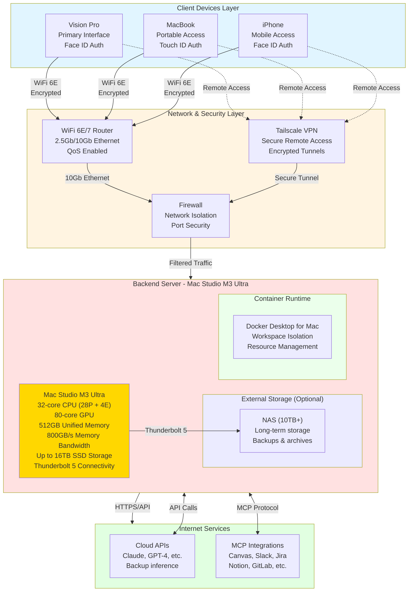

# Hardware Architecture - Master AI Workspace System

## Physical Infrastructure & Network Topology



## Hardware Specifications

### Client Devices
| Device | Role | Authentication | Connectivity |
|--------|------|----------------|--------------|
| **Vision Pro** | Primary AR/VR interface | Face ID biometric | WiFi 6E |
| **MacBook** | Portable development | Touch ID biometric | WiFi 6E / Ethernet |
| **iPhone** | Mobile quick access | Face ID biometric | WiFi 6E / 5G |

### Network Infrastructure
| Component | Specification | Purpose |
|-----------|--------------|---------|
| **Router** | WiFi 6E/7, 2.5-10Gb Ethernet | High-speed connectivity with QoS |
| **VPN** | Tailscale mesh network | Secure remote access anywhere |
| **Firewall** | Hardware or pfSense | Network isolation & security |
| **Budget** | $300-600 | Quality prosumer networking gear |

### Backend Server (AI Inference Engine)

#### Mac Studio M3 Ultra (2025)
**Apple's Most Powerful Desktop**
- **CPU:** 32-core (28 performance + 4 efficiency cores)
- **GPU:** 80-core unified architecture
- **Neural Engine:** 32-core for AI acceleration
- **Unified Memory:** 512GB (shared CPU/GPU/Neural Engine)
- **Memory Bandwidth:** 800GB/s
- **Capability:** Run models up to 400B+ parameters (quantized)
- **Cost:** $9,499 (512GB config) | $14,099 (fully maxed)
- **Why:** Largest unified memory on any personal computer, native macOS integration
- **Inference Framework:** MLX, llama.cpp, or vLLM with Metal acceleration

#### Internal Storage
- **Configuration:** Up to 16TB internal SSD
- **Performance:** High-bandwidth NVMe for workspace access
- **Recommendation:** 4TB-8TB for active workspaces

#### External Storage Strategy
| Drive Type | Capacity | Purpose | Connection |
|------------|----------|---------|------------|
| **Thunderbolt RAID** | 4TB+ | Hot storage for large models | Thunderbolt 5 (120Gbps) |
| **NAS** | 10TB+ | Long-term storage, backups, archives | 10Gb Ethernet |

### Power & Cooling
- **Power Consumption:** ~200W typical, ~300W peak
- **Cooling:** Apple-designed thermal architecture (quiet, efficient)
- **UPS:** 1000VA+ for power protection (lower draw than PC build)

## Network Topology

### Local Network Architecture
```
Internet
   ↓
ISP Modem (bridge mode)
   ↓
Router (WiFi 6E + 10Gb Ethernet)
   ├─→ Vision Pro (WiFi)
   ├─→ MacBook (WiFi/Ethernet)
   ├─→ iPhone (WiFi)
   └─→ Mac Studio (10Gb Ethernet) ← Priority QoS
```

### Remote Access Security Layers
```
User Device (anywhere)
   ↓
Tailscale VPN (encrypted tunnel)
   ↓
Home Network Firewall
   ↓
Mac Studio
   ↓
Biometric Re-auth (Face ID/Touch ID)
   ↓
Workspace Access Granted
```

## Security Architecture

### Layer 1: Network Security
- **VPN Encryption:** WireGuard protocol (Tailscale)
- **Firewall Rules:** Only Tailscale and essential ports open
- **No Port Forwarding:** Zero exposed services to public internet

### Layer 2: Device Authentication
- **Biometric:** Face ID (Vision Pro, iPhone) / Touch ID (MacBook)
- **Multi-factor:** Biometric + device possession
- **Timeout:** Auto-lock after inactivity

### Layer 3: Workspace Isolation
- **Container-level:** Each workspace in separate Docker container
- **Network Isolation:** Workspace containers on separate virtual networks
- **Credential Isolation:** Environment variables, secrets per workspace

### Layer 4: Data Encryption
- **Storage:** FileVault 2 full-disk encryption (T2/M-series secure enclave)
- **Transit:** TLS 1.3 for all API communications
- **Backups:** Encrypted at rest with Time Machine encryption

## Performance Targets

### Latency Goals
| Operation | Target Latency | Notes |
|-----------|---------------|-------|
| **User input → Master response** | <300ms | Orchestration layer (native macOS) |
| **Local LLM inference (70B)** | 30-60 tokens/sec | With M3 Ultra + MLX optimization |
| **Local LLM inference (405B quantized)** | 10-20 tokens/sec | 512GB unified memory advantage |
| **MCP tool call** | 500ms - 2s | Depends on external API |
| **Workspace switch** | <200ms | Container already running |
| **Cold workspace start** | 2-5s | Docker Desktop for Mac |

### Bandwidth Requirements
- **Local Network:** 10Gb Ethernet recommended for Mac Studio
- **Internet:** 500Mbps+ symmetric (for cloud API fallback)
- **Storage I/O:** Internal SSD provides 5000-7000+ MB/s
- **Thunderbolt 5:** 120Gbps for external RAID/NAS

## Scalability Considerations

### Current Design (Single Mac Studio)
- **Users:** 1 (personal use)
- **Concurrent Workspaces:** 4-8 active
- **Max Sub-agents:** 10-20 simultaneously
- **Model Size:** Up to 405B parameters (quantized)

### Future Scaling Options
- **Second Mac Studio:** Link via Thunderbolt or 10Gb Ethernet for distributed inference
- **Mac Pro:** Upgrade to Mac Pro for PCIe expansion (future compatibility)
- **Distributed:** LangGraph supports distributed agent networks across Macs
- **Cloud Hybrid:** Offload heavy workloads to cloud during peak
- **Kubernetes:** Graduate from Docker to K8s for multi-node (macOS supports K8s)

## Cost Breakdown

| Component | Cost | Notes |
|-----------|------|-------|
| **Mac Studio M3 Ultra Base** | $3,999 | 28-core CPU, 60-core GPU, 96GB RAM, 1TB |
| **+ 512GB Unified Memory** | +$5,500 | Critical for large model inference |
| **+ Storage Upgrade (8TB)** | +$2,000 | Recommended for workspaces + models |
| **Thunderbolt RAID/NAS** | $800-1,500 | External storage for backups |
| **Networking (Router/Switch)** | $300-600 | 10Gb Ethernet + WiFi 6E |
| **UPS** | $150-250 | Battery backup (lower wattage needed) |
| **TOTAL (Recommended Config)** | **~$12,700-13,900** | Mac Studio + peripherals |
| **TOTAL (Maxed Out)** | **~$16,400** | 512GB RAM + 16TB storage + accessories |

### Mac Studio Configuration Options

| Config | RAM | Storage | Price | Use Case |
|--------|-----|---------|-------|----------|
| **Base M3 Ultra** | 96GB | 1TB | $3,999 | Light AI workloads |
| **Recommended** | 512GB | 8TB | $11,499 | Large model inference (200B+) |
| **Maxed Out** | 512GB | 16TB | $14,099 | Maximum capability |

### Phased Purchase Strategy
1. **Phase 0 (Prototype):** Use existing MacBook, cloud APIs ($0)
2. **Phase 1 (MVP):** Mac Studio base config, test workloads ($4,000)
3. **Phase 2 (Production):** Upgrade to 512GB RAM for local inference (+$5,500)
4. **Phase 3 (Scale):** Add storage, networking, UPS (+$2,000-3,000)

## Maintenance & Operations

### Monitoring
- **System Performance:** Activity Monitor, iStat Menus, or asitop (Apple Silicon monitoring)
- **GPU/Neural Engine:** Metal Performance HUD, MLX metrics
- **Container Health:** Docker Desktop dashboard, Docker stats
- **Network Performance:** Router metrics, bandwidth monitoring
- **Storage:** macOS built-in SMART monitoring, Disk Utility

### Backup Strategy
- **Configuration:** Git repo (nightly commit)
- **Workspace Data:** Time Machine to NAS (hourly incremental)
- **Full System:** Time Machine snapshots (automatic)
- **Off-site:** iCloud+ or cloud backup of critical data (continuous)
- **Clone:** Carbon Copy Cloner for bootable backup (weekly)

### Power Management
- **Idle Mode:** Apple Silicon automatically manages power efficiency
- **Sleep Workspaces:** Stop containers after 30min inactivity
- **Wake-on-LAN:** macOS supports wake for network access
- **Estimated Power:** 50-100W idle, 200-300W peak (inference workload)
- **Energy Efficiency:** ~60% less power than equivalent PC build

---

**Document Type:** Technical Design Specification
**Status:** Conceptual Architecture
