# Software Architecture - Master AI Workspace System

## System Overview: Hierarchical Multi-Workspace AI Orchestrator

```mermaid
graph TB
    subgraph User["User Interface Layer"]
        U["User<br/>Single conversation interface<br/>Multi-device (VP/MB/iPhone)"]
    end

    subgraph Master["Master Instance - 'JARVIS' Orchestrator"]
        Router["Request Router<br/>Intent Analysis<br/>Workspace Selection"]
        Memory["Working Memory<br/>Context Switching<br/>Conversation State"]
        Synth["Result Synthesizer<br/>Multi-workspace aggregation<br/>Unified response"]
        NoTools["⚠️ NO Direct Tool Access<br/>Clean separation of concerns"]
    end

    subgraph Workspaces["Workspace Isolation Layer"]
        subgraph School["School Workspace"]
            S_MCP["MCP Tools<br/>• Canvas<br/>• GitLab<br/>• Teams<br/>• Notion"]
            S_Browser["Browser Instance<br/>School accounts<br/>SSO sessions"]
            S_Agents["Sub-Agent Team<br/>• Code Agent<br/>• Research Agent<br/>• Assignment Agent"]
            S_FS["File System<br/>/workspaces/school/<br/>LLM-optimized"]
            S_Creds["Credentials<br/>School email<br/>API keys<br/>SSH keys"]
        end

        subgraph Work["Work Workspace"]
            W_MCP["MCP Tools<br/>• Slack<br/>• Jira<br/>• Company Git<br/>• Internal APIs"]
            W_Browser["Browser Instance<br/>Work accounts<br/>Corporate SSO"]
            W_Agents["Sub-Agent Team<br/>• DevOps Agent<br/>• Code Review Agent<br/>• PM Agent"]
            W_FS["File System<br/>/workspaces/work/<br/>LLM-optimized"]
            W_Creds["Credentials<br/>Work email<br/>API keys<br/>SSH keys"]
        end

        subgraph Personal["Personal Workspace"]
            P_MCP["MCP Tools<br/>• Personal Git<br/>• Productivity<br/>• Finance<br/>• Health"]
            P_Browser["Browser Instance<br/>Personal accounts<br/>Services"]
            P_Agents["Sub-Agent Team<br/>• Project Agent<br/>• Learning Agent<br/>• Life Admin Agent"]
            P_FS["File System<br/>/workspaces/personal/<br/>LLM-optimized"]
            P_Creds["Credentials<br/>Personal email<br/>API keys<br/>Crypto"]
        end

        subgraph Project["Project Workspace"]
            L_MCP["MCP Tools<br/>• Project-specific<br/>• Custom integrations<br/>• APIs"]
            L_Browser["Browser Instance<br/>Project accounts<br/>Services"]
            L_Agents["Sub-Agent Team<br/>• Backend Agent<br/>• Frontend Agent<br/>• Design Agent"]
            L_FS["File System<br/>/workspaces/project/<br/>LLM-optimized"]
            L_Creds["Credentials<br/>Project accounts<br/>API keys<br/>Deployment"]
        end
    end

    subgraph External["External Services & APIs"]
        CloudLLM["Cloud LLMs<br/>Claude, GPT-4<br/>Backup inference"]
        LocalLLM["Local LLM<br/>DGX Spark<br/>Privacy-sensitive"]
        APIs["External APIs<br/>Canvas, Slack<br/>GitHub, etc."]
    end

    %% User to Master
    U -->|Natural language request| Router
    Synth -->|Synthesized response| U

    %% Master to Workspaces (routing logic)
    Router -.->|"Route: Assignment help"| School
    Router -.->|"Route: Work emails"| Work
    Router -.->|"Route: Personal project"| Personal
    Router -.->|"Route: Project task"| Project

    %% Router uses Memory
    Router <--> Memory

    %% Workspaces report back to Synthesizer
    School -->|Results| Synth
    Work -->|Results| Synth
    Personal -->|Results| Synth
    Project -->|Results| Synth

    %% Workspace internal connections
    S_MCP <--> S_Agents
    S_Browser <--> S_Agents
    S_FS <--> S_Agents
    S_Creds -.->|Isolated| S_MCP
    S_Creds -.->|Isolated| S_Browser

    W_MCP <--> W_Agents
    W_Browser <--> W_Agents
    W_FS <--> W_Agents
    W_Creds -.->|Isolated| W_MCP
    W_Creds -.->|Isolated| W_Browser

    P_MCP <--> P_Agents
    P_Browser <--> P_Agents
    P_FS <--> P_Agents
    P_Creds -.->|Isolated| P_MCP
    P_Creds -.->|Isolated| P_Browser

    L_MCP <--> L_Agents
    L_Browser <--> L_Agents
    L_FS <--> L_Agents
    L_Creds -.->|Isolated| L_MCP
    L_Creds -.->|Isolated| L_Browser

    %% External connections
    Router --> LocalLLM
    Router --> CloudLLM

    S_MCP --> APIs
    W_MCP --> APIs
    P_MCP --> APIs
    L_MCP --> APIs

    S_Agents --> LocalLLM
    W_Agents --> LocalLLM
    P_Agents --> LocalLLM
    L_Agents --> LocalLLM

    style User fill:#e1f5ff
    style Master fill:#ffe1e1
    style Workspaces fill:#f0f0f0
    style School fill:#e8f5e9
    style Work fill:#fff3e0
    style Personal fill:#f3e5f5
    style Project fill:#e3f2fd
    style External fill:#fce4ec
    style NoTools fill:#ffcdd2
```

## Detailed Component Architecture

### Master Instance - "JARVIS" Orchestrator

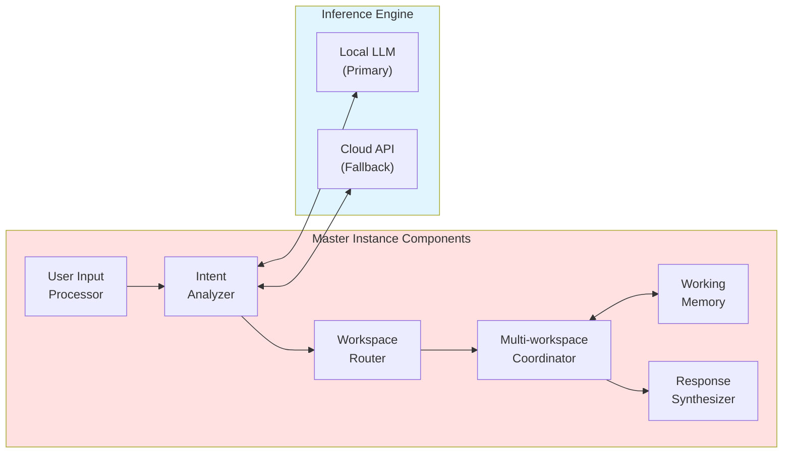

**Key Responsibilities:**
1. **Request Routing:** Analyze user intent and route to appropriate workspace(s)
2. **Context Management:** Maintain conversation state across workspace switches
3. **Multi-workspace Coordination:** Handle requests spanning multiple domains
4. **Result Synthesis:** Aggregate results from multiple workspaces into coherent response
5. **NO Direct Tool Access:** Enforces clean architecture - all tools through workspaces

**Technology Stack:**
- **Framework:** LangGraph (orchestration), LangChain (LLM interface)
- **State Management:** Redis or in-memory state store
- **Routing Logic:** LLM-powered intent classification + rule-based routing
- **Inference:** Primary = Local LLM, Fallback = Claude API

---

### Workspace Architecture (Per Workspace)

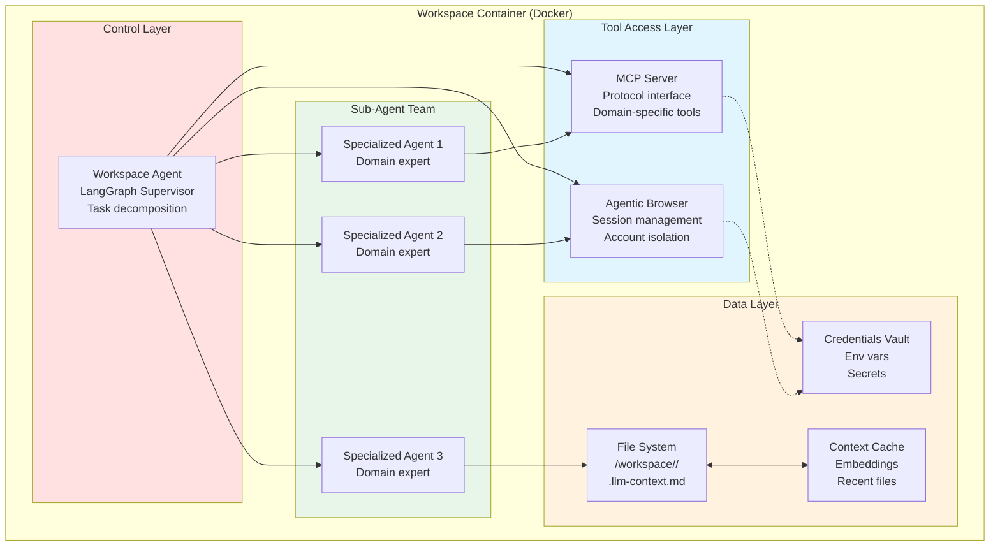

**Components:**

#### 1. Workspace Agent (Supervisor)
- **Role:** Receives tasks from Master, delegates to sub-agents
- **Pattern:** LangGraph supervisor pattern
- **Responsibilities:**
  - Task decomposition
  - Sub-agent coordination
  - Tool access management
  - Result aggregation back to Master

#### 2. MCP Tools
- **Protocol:** Model Context Protocol
- **Purpose:** Standardized interfaces to external services
- **Examples per Workspace:**
  - School: Canvas, GitLab, Microsoft Teams, Notion
  - Work: Slack, Jira, Company Git, Internal APIs
  - Personal: GitHub, Productivity tools, Finance APIs
  - Project: Project-specific integrations

#### 3. Agentic Browser
- **Technology:** Browser-Use, Skyvern, or Playwright + LLM
- **Capabilities:**
  - Navigate web with reasoning
  - Fill forms, click buttons
  - Extract structured data
  - Handle authentication flows
- **Isolation:** Each workspace has separate browser profile
  - Cookies, sessions, local storage isolated
  - Separate accounts logged in per workspace

#### 4. Sub-Agent Team
- **Pattern:** Specialized agents for specific tasks
- **Examples:**
  - Code Agent: Write/review/debug code
  - Research Agent: Gather information, summarize
  - DevOps Agent: Deployment, monitoring
  - PM Agent: Project management, planning
- **Communication:** Coordinate through Workspace Agent

#### 5. File System (LLM-Optimized)
```
/workspaces/<workspace-name>/
  ├── .workspace-config.json       # Workspace metadata
  ├── .llm-context.md              # Context file for LLM
  ├── projects/
  │   └── <project-name>/
  │       ├── .llm-context.md      # Project-level context
  │       ├── src/
  │       ├── docs/
  │       └── tests/
  ├── knowledge/
  │   ├── embeddings/              # Vector store
  │   └── notes/                   # Markdown notes
  └── cache/
      └── recent_files_index.json
```

**Key Features:**
- **`.llm-context.md` files:** Tell LLM where to find things
- **Standardized structure:** Predictable for tool access
- **Embeddings:** Semantic search over workspace content
- **Index caching:** Fast file lookups

#### 6. Credentials Vault
- **Storage:** Environment variables, encrypted secrets file
- **Isolation:** Each workspace has separate credential store
- **Types:**
  - API keys (Canvas, Slack, etc.)
  - SSH keys (for Git operations)
  - OAuth tokens
  - Database credentials
- **Access:** Only workspace's tools can access its credentials

---

## Data Flow Patterns

### Pattern 1: Single Workspace Query

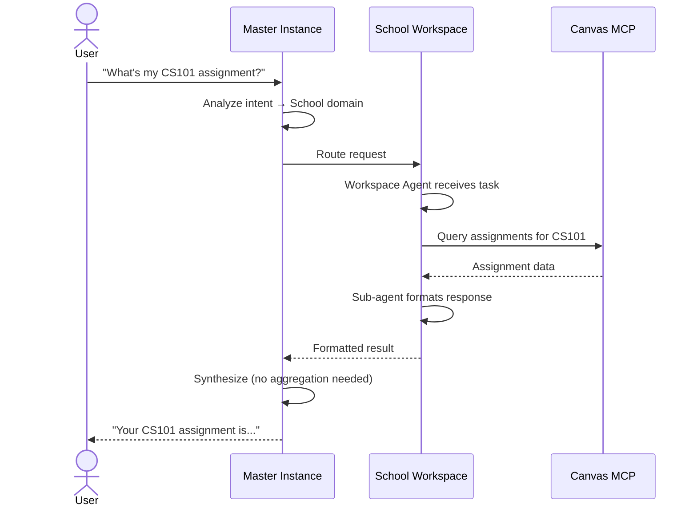

### Pattern 2: Multi-Workspace Query

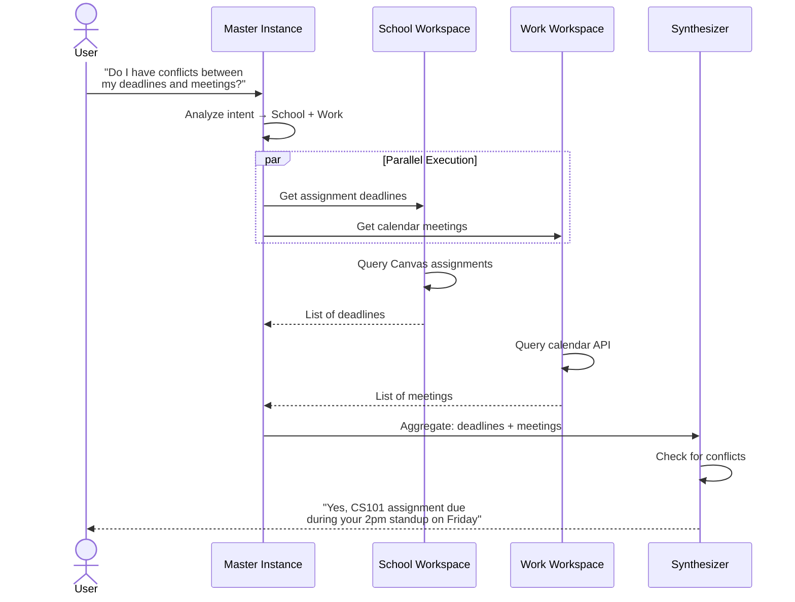

### Pattern 3: Sub-Agent Coordination

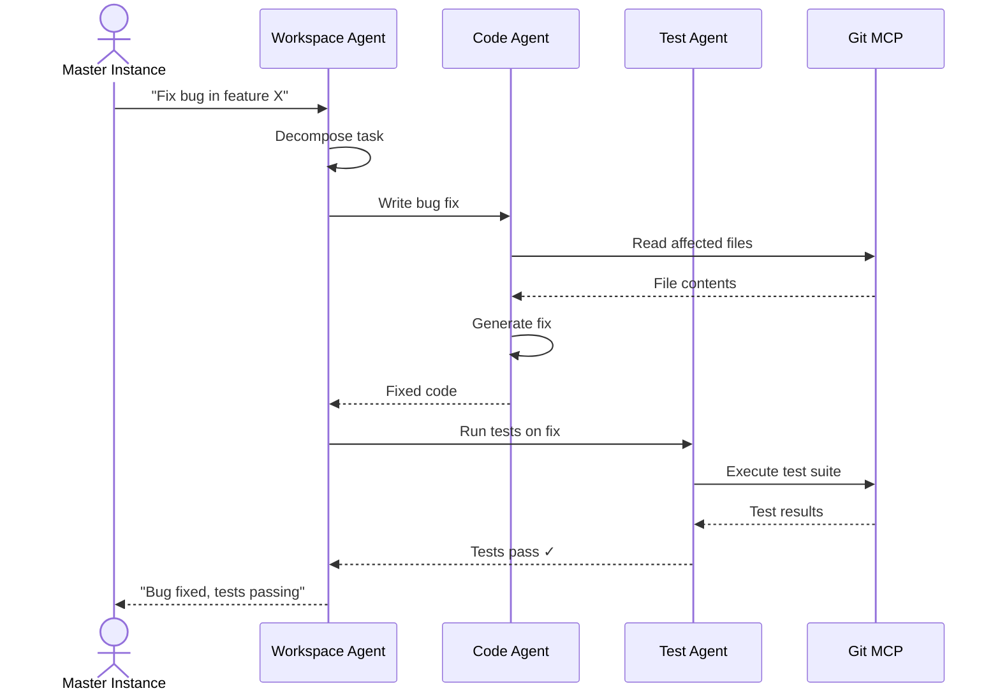

---

## Isolation Boundaries

### Container-Level Isolation (Docker)

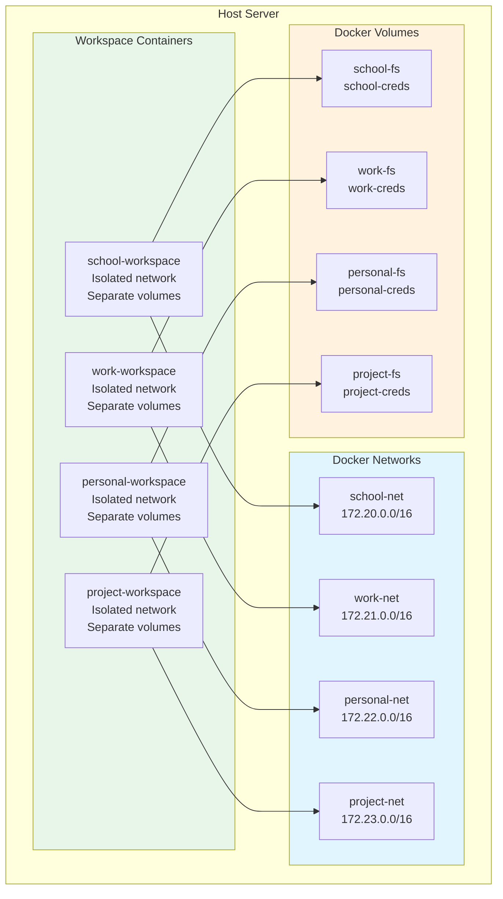

**Isolation Guarantees:**
- ✅ **Network:** Workspaces cannot see each other's traffic
- ✅ **File System:** Separate volumes, no cross-access
- ✅ **Process:** Separate process namespaces
- ✅ **Credentials:** Environment variables isolated per container
- ✅ **Browser Sessions:** Separate browser profiles/data directories

### Cross-Workspace Data Flow (Controlled)

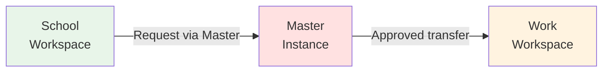

**Rules:**
1. **No Direct Communication:** Workspaces cannot talk to each other directly
2. **Master Mediation:** All cross-workspace data flows through Master
3. **User Approval:** Sensitive data transfers require explicit user confirmation
4. **Audit Log:** All cross-workspace transfers logged

---

## Technology Stack

### Core Frameworks

| Component | Technology | Purpose |
|-----------|-----------|---------|
| **Orchestration** | LangGraph | Multi-agent coordination, state management |
| **LLM Interface** | LangChain | Unified LLM API, prompt management |
| **MCP Protocol** | Anthropic MCP | Standardized tool interfaces |
| **Containerization** | Docker / Docker Compose | Workspace isolation |
| **Agentic Browser** | Browser-Use / Skyvern | Web automation with reasoning |
| **Vector Store** | ChromaDB / FAISS | Semantic search over workspace content |
| **State Store** | Redis | Fast in-memory state for conversations |
| **File Watching** | Watchdog (Python) | Detect file changes for context updates |

### Local LLM Stack

| Component | Technology | Purpose |
|-----------|-----------|---------|
| **Inference Engine** | vLLM / TensorRT-LLM | Optimized local inference |
| **Model Format** | GGUF / AWQ | Quantized models for efficiency |
| **Model Management** | Ollama | Easy model downloading and switching |
| **Primary Model** | Llama 3.1 70B / DeepSeek Coder | General reasoning + code |
| **Specialized Models** | CodeLlama, Mistral variants | Task-specific models |

### MCP Integrations (Per Workspace)

**School:**
- Canvas LMS (assignments, grades)
- GitLab (code repositories)
- Microsoft Teams (collaboration)
- Notion (notes, organization)

**Work:**
- Slack (communication)
- Jira (project management)
- Company Git (enterprise GitLab/GitHub)
- Internal APIs (company-specific)

**Personal:**
- GitHub (personal projects)
- Todoist / Notion (productivity)
- Finance APIs (Plaid, Mint)
- Health/Fitness APIs

**Project:**
- Project-specific tools
- Custom MCP servers
- Deployment platforms
- Analytics services

---

## State Management

### Master Instance State

```python
{
    "conversation_id": "uuid",
    "user_id": "user_id",
    "active_workspaces": ["school", "work"],
    "context_stack": [
        {
            "workspace": "school",
            "task": "assignment query",
            "timestamp": "2025-10-18T10:30:00Z"
        }
    ],
    "working_memory": {
        "recent_results": [...],
        "pending_tasks": [...],
        "user_preferences": {...}
    }
}
```

### Workspace State

```python
{
    "workspace_id": "school",
    "status": "active",
    "container_id": "docker_container_id",
    "active_sub_agents": ["code_agent", "research_agent"],
    "current_tasks": [
        {
            "task_id": "uuid",
            "description": "Query Canvas for assignments",
            "status": "in_progress",
            "assigned_to": "research_agent"
        }
    ],
    "context_cache": {
        "recent_files": [...],
        "embeddings_index": "path/to/index"
    }
}
```

---

## Error Handling & Recovery

### Failure Modes

| Failure | Detection | Recovery Strategy |
|---------|-----------|-------------------|
| **Workspace crash** | Docker health check | Auto-restart container, restore state |
| **MCP tool timeout** | Request timeout | Retry with exponential backoff, fallback to browser |
| **LLM inference failure** | Exception handling | Fallback to cloud API (Claude/GPT-4) |
| **Sub-agent error** | Task monitoring | Reassign task to different agent, escalate to user |
| **Network partition** | Connection monitoring | Queue requests, retry when reconnected |

### Checkpointing

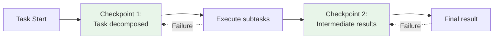

**Strategy:**
- Save state at key milestones
- Enable resume from last checkpoint
- Avoid re-doing expensive operations

---

## Security Model

### Authentication & Authorization

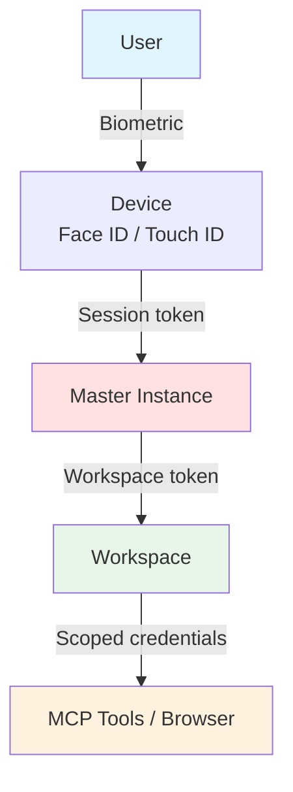

**Principles:**
1. **Biometric First:** Device-level authentication
2. **Session Tokens:** Short-lived tokens for Master access
3. **Workspace Tokens:** Scoped tokens for workspace operations
4. **Least Privilege:** Tools only access their required credentials
5. **Audit Logging:** All credential access logged

### Credential Management

**Per-Workspace `.env` file:**
```bash
# School Workspace Credentials
CANVAS_API_KEY=xxx
GITLAB_TOKEN=xxx
TEAMS_CLIENT_ID=xxx
NOTION_API_KEY=xxx
SCHOOL_EMAIL=student@school.edu
```

**Storage:**
- Encrypted at rest (SOPS, age, or Vault)
- Only accessible within workspace container
- Never logged or transmitted to Master

---

## Observability & Debugging

### Monitoring Stack

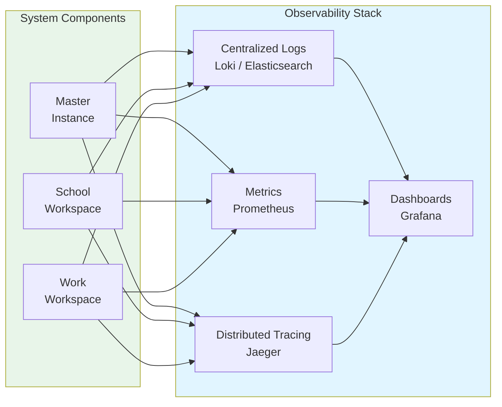

**Metrics to Track:**
- Request routing accuracy (% correct workspace)
- Task completion time per workspace
- LLM inference latency (local vs cloud)
- MCP tool call success rate
- Sub-agent error rate
- Context cache hit rate

### Debug Mode

User can enable explicit workspace visibility:

```
User: "Debug mode: Show me which workspaces you're querying"

Jarvis: "[Routing to School workspace...]
         [Querying Canvas MCP...]
         [Results received from School]

         Your CS101 assignment is due Friday."
```

---

## Future Enhancements

### Phase 1 (MVP)
- ✅ Master orchestrator with routing
- ✅ 2-3 workspaces (School, Personal)
- ✅ MCP tool integrations
- ✅ Basic sub-agent deployment

### Phase 2 (Full System)
- ⏳ All 4 workspaces
- ⏳ Agentic browser integration
- ⏳ Container isolation (Docker)
- ⏳ Credential management system

### Phase 3 (Advanced Features)
- 🔮 Knowledge graphs per workspace
- 🔮 Automatic task scheduling
- 🔮 Proactive suggestions
- 🔮 Voice interface (Vision Pro)
- 🔮 Multi-user support (family members)

### Phase 4 (Production Hardening)
- 🔮 High availability (container orchestration)
- 🔮 Disaster recovery
- 🔮 Performance optimization
- 🔮 Cost optimization (local vs cloud routing)

---

**Document Type:** Technical Design Specification
**Status:** Conceptual Architecture
